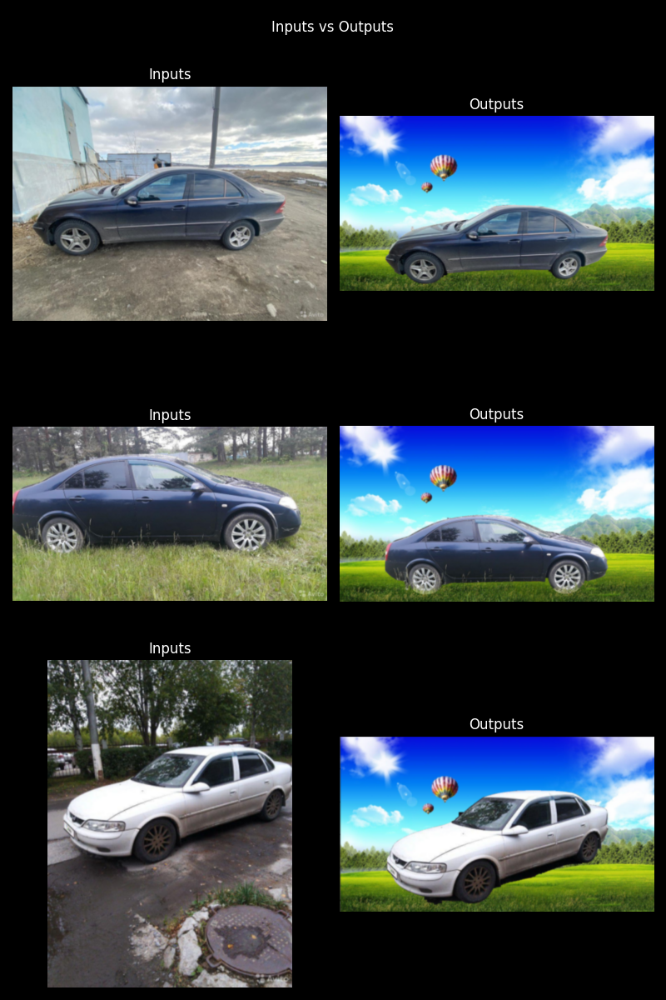

# Car Segmentation and adding Virtual Background using U2NET#


[](https://opensource.org/licenses/MIT)
[](https://colab.research.google.com/drive/12M11-92dJsxa0-ATp1yCKMadUDegIfR2#scrollTo=R87wY_p1yEAO)

This project utilizes the U2Net deep learning model to perform car segmentation in images. After segmenting the car from the background, it allows you to replace the background with a virtual background of your choice.

I suggest utilizing the provided Colab notebook for a comprehensive explanation, as I have employed this notebook for tasks such as data creation, training, inference, and visualization.



This section describes how to use the pretrained model for car segmentation and add a virtual background to car images.

## Pretrained Model

To perform car segmentation and add virtual backgrounds, you'll need to download the pretrained U2Net model from this [link](https://drive.google.com/file/d/1ao1ovG1Qtx4b7EoskHXmi2E9rp5CHLcZ/view) (168 MB). Once downloaded, place it in the `saved_models/u2net` folder.

## Running Inference

You can run inference by provid ing the following arguments:

- `--image_dir`: Path to the directory containing car images.
- `--mask_dir`: Path to the directory containing segmentation masks generated by U2Net.
- `--background_path`: Path to the virtual background image you want to use.
- `--save_dir`: Path to the directory where the output images will be saved.

Here's the command to run inference:

```bash
python car_virtual_background.py --image_dir /path/to/car/images --mask_dir /path/to/segmentation/masks --background_path /path/to/virtual/background.jpg --save_dir /path/to/output/directory
```

For example:

```bash
python car_virtual_background.py --image_dir /content/U-2-Net/dataset/Image --mask_dir /content/U-2-Net/runs/u2net_muti_dice_loss_checkpoint_epoch_200_results  --background_path /content/U-2-Net/saved_models/background.jpg --save_dir /content/U-2-Net/car_virtual_bg/u2net_dice_200
```

The output images will be saved in the `save_dir` directory specified in the command.

### OR 
- Inference in colab from here [](https://colab.research.google.com/drive/12M11-92dJsxa0-ATp1yCKMadUDegIfR2#scrollTo=R87wY_p1yEAO)

# Acknowledgements
- U2net model is from original [u2net repo](https://github.com/xuebinqin/U-2-Net). Thanks to Xuebin Qin for amazing repo.
- Complete repo follows structure of [Pix2pixHD repo](https://github.com/NVIDIA/pix2pixHD)
